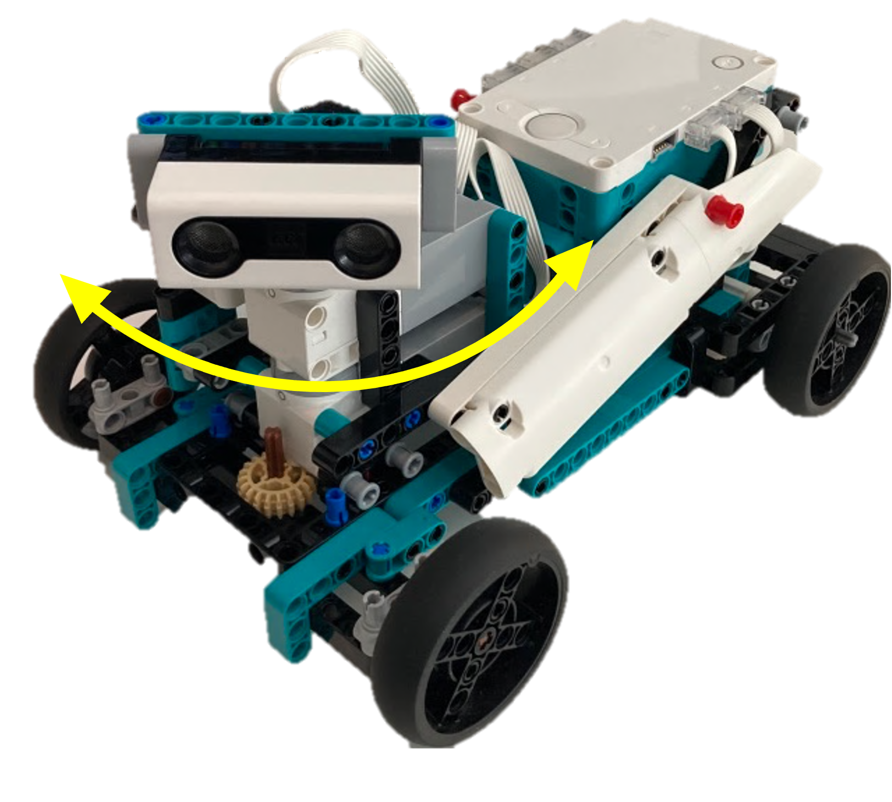
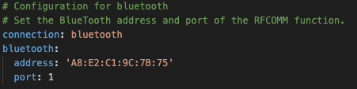

# A.T.O.M. | Automatic Tracklab Originate Module

A.T.O.M. is our Automatic Tracklab Originate Module. With A.T.O.M. you can simulate the behavior of ill and healthy cows. This repository contains all the things needed to run A.T.O.M. on your own Lego Spike Prime Hub and PC. A.T.O.M. consists of two parts: the on-device program and a pc side program. The program on the device itself simulates the cow itself and mimics the ill and healthy state. It's also capable of navigating around trains itself and shouldn't hit any walls.
The program on the PC is responsible for measuring the distance the robot has driven with an accuracy of 0.2 meters. Our client wanted this feature to compare it to their Tracklab software.

## Requirements
To use A.T.O.M. yourself you need a few things:
- A PC supporting Bluetooth 5.0 with:
    - Linux
    - Mac OS (Big Sur or later recommended)
    - Windows 7 or later
- A [Lego Mindstorms 51515](https://www.lego.com/en-us/product/robot-inventor-51515) set
- Something which functions the same as our lego build:

## Changing the Bluetooth MAC address of the Lego Spike Prime Hub

If you want to use this program with your own Lego Spike Prime Hub, you're in luck, because you can! The only thing you have to do is change the MAC address in the config file. Navigate to <code>/App/lego_hub.yaml</code> and open it with a text editor such as NotePad. Next scroll down until you see this piece of text:

The MAC address seen in the picture is the one for my Lego Spike Prime HUB, you're MAC address is different from mine, however. To get the MAC address of you're Lego Spike Prime Hub you first need to [pair](https://education.lego.com/en-us/product-resources/spike-prime/troubleshooting/bluetooth-connectivity) it with your system. Now you can get the MAC address of you are hub and replace the current MAC address with your own.